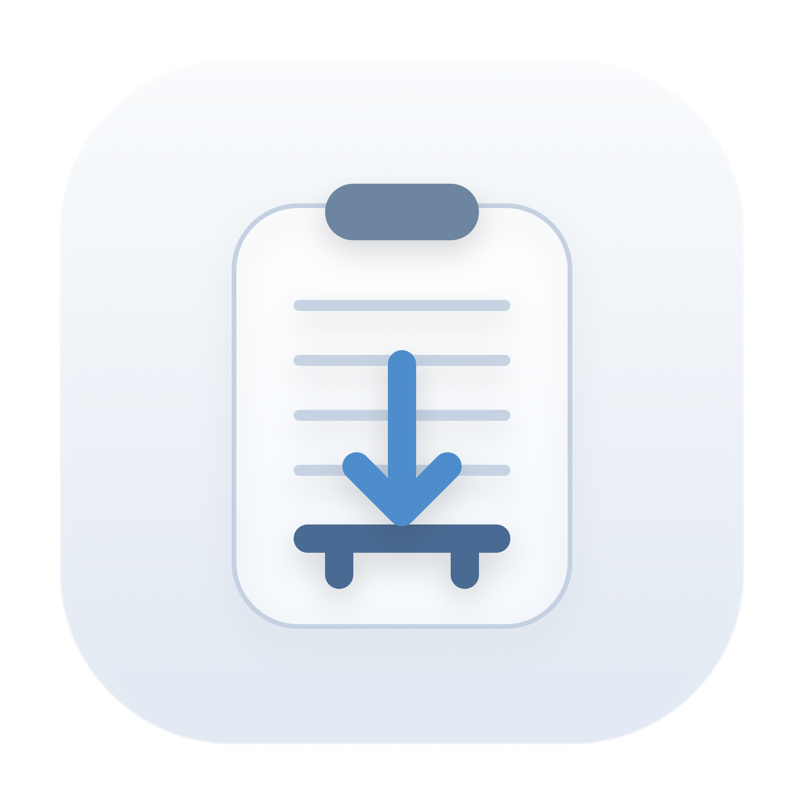

# Buffer Save for macOS



Buffer Save is a native macOS menu bar utility that saves selected text, clipboard text, or clipboard images into a file and then puts the absolute path to that file back into the clipboard.

## What It Does

- Saves selected text from the currently focused app when Accessibility access is available
- Falls back to clipboard image or clipboard text when selected text is unavailable
- Writes the saved file path back to the clipboard
- Runs from the macOS menu bar and starts automatically after login
- Lets you rebind the global hotkey directly from the menu bar popover

## Features

- Menu bar utility with launch-at-login support
- Selected text capture through Accessibility API with clipboard fallback
- Clipboard text saved as `.txt`
- Clipboard images saved as `.png`
- Configurable global hotkey stored in `UserDefaults`
- Temporary menu bar status icon that resets after 5 seconds

## Permissions

Buffer Save can save selected text from other apps only when macOS Accessibility access is enabled for the app.

Open:

- System Settings
- Privacy & Security
- Accessibility

If Accessibility is unavailable, Buffer Save falls back to clipboard content and shows a one-time reminder for the current app session.

## Hotkey

- Default hotkey: `Command+F1`
- Change the hotkey directly in the menu bar popover
- The shortcut must include at least one modifier
- `Esc` cancels hotkey recording

## Build

```bash
swift test
./Scripts/build-app.sh
```

This creates:

- `Build/BufferSave.app`

## Install And Run

```bash
./Scripts/run-app.sh
```

This flow:

- builds the release app
- generates the app icon
- installs the app into `~/Applications/BufferSave.app`
- launches the app

The app also installs a user `LaunchAgent` so it starts automatically after login.

## Download

The public repository is available here:

- [github.com/Alexandr-Kravchuk/buffer-save-macos](https://github.com/Alexandr-Kravchuk/buffer-save-macos)

Release builds are published in GitHub Releases as a zipped `.app` bundle.

## Saved Files

Files are saved into:

- `~/Downloads/Buffer Save`

Naming:

- text: `yyyy-MM-dd_HH-mm-ss_slug.txt`
- image: `yyyy-MM-dd_HH-mm-ss_image.png`

## Development

Run tests:

```bash
swift test
```

Install the current build:

```bash
./Scripts/install-app.sh
```
